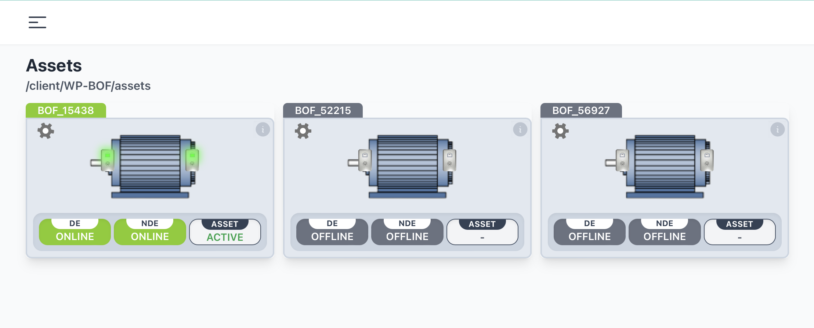
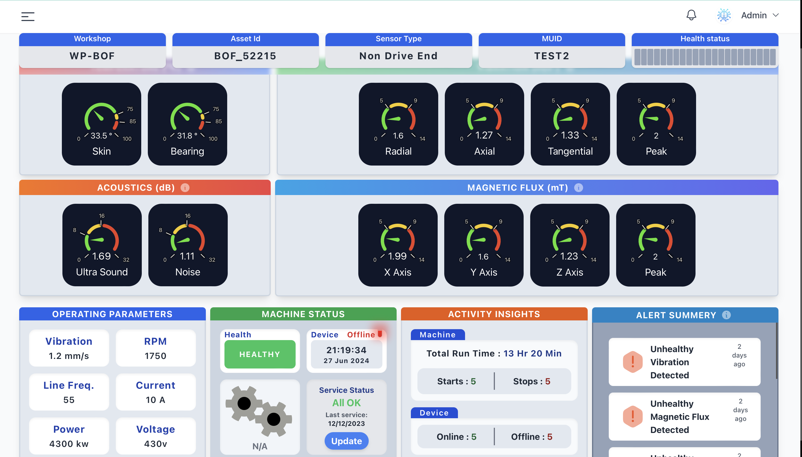
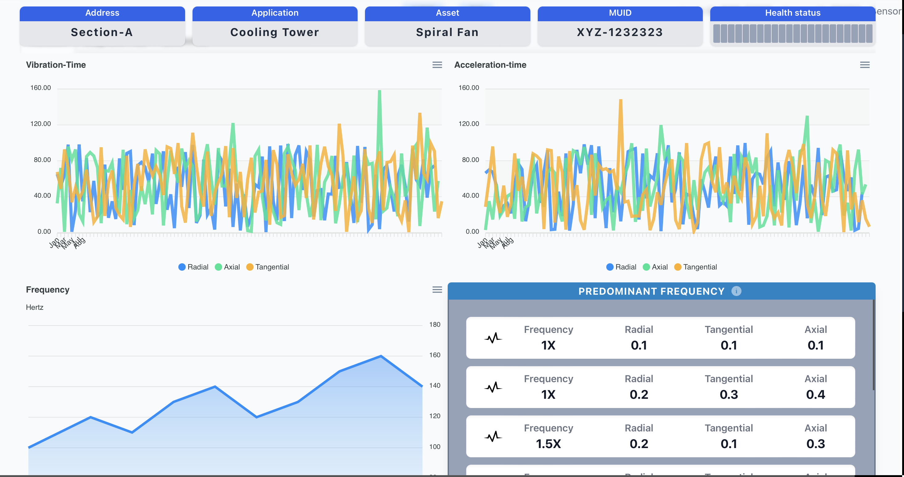

# Equipment Health Monitoring

[](LICENSE)

 </img>

## Table of Contents
- [Overview](#overview)
- [Features](#features)
- [Technologies Used](#technologies-used)
- [Installation](#installation)
- [Usage](#usage)
- [Screenshots](#screenshots)
- [Contact](#contact)

## Overview 🔍🔍
The Equipment Health Monitoring project aims to provide a comprehensive solution for monitoring and assessing the health of various equipment in real-time. By leveraging sensor data and advanced algorithms, the system can predict potential failures and maintenance needs, thereby minimizing downtime and improving operational efficiency.The system also has the capability to take firmware updates and its maintainance updates over the air , through the network.

## Features 🚀🚀
- Real-time monitoring of equipment health
- Predictive maintenance alerts
- Detailed analytics and reporting
- User-friendly interface
- Over the Air Firmware Updates to EHM Devices
- Scalable and customizable architecture


## Technologies Used 👨🏻‍💻👨🏻‍💻

- **Hardware:** Node Red, Mosquitto, MQTT, ESP-IDF, Sensors, Open Source MicroControllers
- **Backend:** Python, Flask, Express JS, Node JS
- **Frontend:** HTML, CSS, JavaScript, React JS
- **Database:** SQLite
- **Others:** Pandas, NumPy, Matplotlib

## Installation 💻 💿
To get a local copy up and running, follow these steps:

1. **Clone the repository:**
    ```sh
    git clone https://github.com/RiteshhGitH/Equipment-Health-Monitoring.git
    ```
2. **Navigate to the project directory:**
    ```sh
    cd Equipment-Health-Monitoring
    ```
3. **Create a virtual environment:**
    ```sh
    python -m venv env
    ```
4. **Activate the virtual environment:**
    - On Windows:
        ```sh
        .\env\Scripts\activate
        ```
    - On macOS/Linux:
        ```sh
        source env/bin/activate
        ```
5. **Install the required dependencies:**
    ```sh
    pip install -r requirements.txt
    ```

## Usage
1. **Run the application:**
    ```sh
    python app.py
    ```
2. Open your web browser and go to `http://localhost:5000` to access the application.

## Screenshots
Here are some screenshots of the application:

*List of some assets connected real-time*


*Dashboard view showing real-time equipment health status.*


*Analytics view providing detailed reports and insights.*

## License
This project is licensed under the MIT License. See the [LICENSE](LICENSE) file for more details.

## Contact
**Ritesh Nandy**
- GitHub: [RiteshhGitH](https://github.com/RiteshhGitH)
- Email: [ritesh.nandyofficial@gmail.com](mailto:ritesh.nandyofficial@gmail.com)
